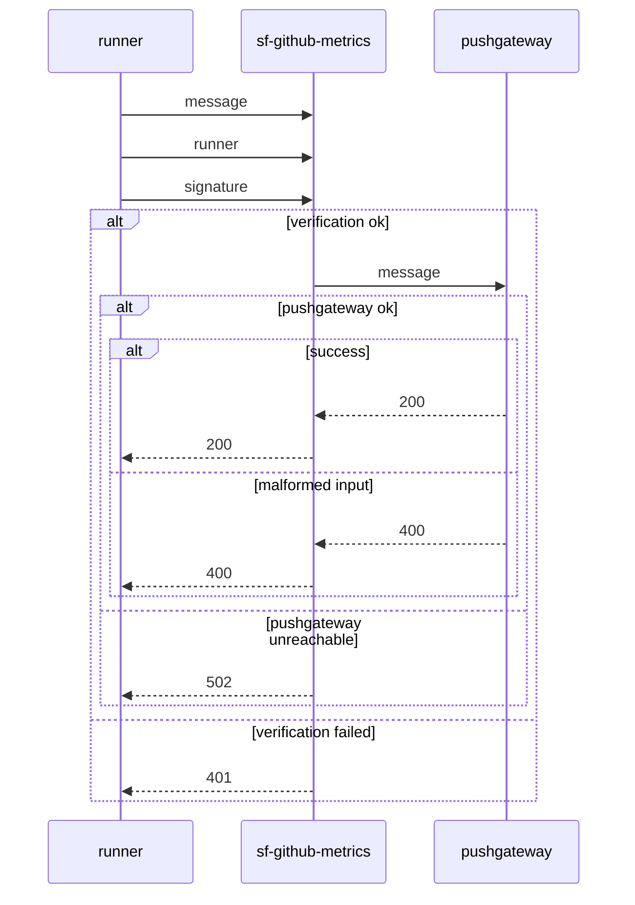

# sf-github-metrics

Simple forwarder to [pushgateway](https://github.com/prometheus/pushgateway),
used from github actions or other runners external to Nav.

## Local testing

### Docker containers

If you want to test locally, you will want to have running:
- prometheus
- prometheus pushgateway
- grafana

Set them up like so:

#### Prometheus

```
mkdir etcprometheus
cat > etcprometheus/prometheus.yml <<EOF
global:
  scrape_interval: 15s
  scrape_timeout: 10s
  scrape_protocols:
  - OpenMetricsText1.0.0
  - OpenMetricsText0.0.1
  - PrometheusText1.0.0
  - PrometheusText0.0.4
  evaluation_interval: 15s
runtime:
  gogc: 75
alerting:
  alertmanagers:
  - follow_redirects: true
    enable_http2: true
    scheme: http
    timeout: 10s
    api_version: v2
    static_configs:
    - targets: []
scrape_configs:
- job_name: prometheus
  honor_timestamps: true
  honor_labels: true
  track_timestamps_staleness: false
  scrape_interval: 15s
  scrape_timeout: 10s
  scrape_protocols:
  - OpenMetricsText1.0.0
  - OpenMetricsText0.0.1
  - PrometheusText1.0.0
  - PrometheusText0.0.4
  metrics_path: /metrics
  scheme: http
  enable_compression: true
  follow_redirects: true
  enable_http2: true
  static_configs:
  - targets:
    - localhost:9090
    - 172.17.0.3:9091
    labels:
      app: prometheus
EOF
```

Use this config to run a prometheus instance:

`docker run -p 9090:9090 -v "$(readlink -f etcprometheus)":/etc/prometheus/ prom/prometheus`

#### Prometheus pushgateway

`docker run -p 9091:9091 prom/pushgateway`

#### Grafana

`docker run -p 3000:3000 grafana/grafana-oss`

### sf-github-metrics

If the docker containers were started in the above order, the gateway should be
running on `172.17.0.3`. You can test this with the following:

`docker ps |while read -r l; do printf '%s  ' "$l"; name=${l##* }; if ! [[ $name = NAMES ]]; then docker inspect -f {{range.NetworkSettings.Networks}}{{.IPAddress}}{{end}} "$name"; else echo; fi; done`

You should get output looking roughly like this:

```
CONTAINER ID   IMAGE                 COMMAND                  ...   NAMES  
60f47cc1e709   prom/pushgateway      "/bin/pushgateway"       ...   brave_hawking  172.17.0.3
4fee037af9d9   prom/prometheus       "/bin/prometheus --c…"   ...   pedantic_wu  172.17.0.2
a6140e758bc2   grafana/grafana-oss   "/run.sh"                ...   objective_wilson  172.17.0.4
```

#### Keys

Before the app will forward your call, you will need to set up a key pair. In a
directory of your choice, run:

```
openssl ecparam -name secp256r1 -genkey -noout -out private.pem
openssl ec -in private.pem -pubout -out public.pem
```

Add the public key to `publicKeys` in `Runners.kt`, using the index `local`.

#### Testing

Now you can run the app:

`./gradlew clean build -x test && docker build . -t sgm && docker run -p 8080:8080 sgm`

In another shell, in the directory containing your private key, run:

`jay() { sig=$(printf %s "$1" | openssl dgst -sha256 -sign private.pem -out - | base64 -w0); jq --compact-output --null-input --arg msg "$1" --arg runner local --arg sig "$sig" '{"metrics":$msg,"runner":$runner,"signature":$sig}'; }`

This will sign the message you pass it and pack it into a JSON payload. We can
use this to send a metric:

`jay 'answer 42' | tee >(curl -D- -H 'Content-Type: application/json' --data-binary @- http://127.1:8080/measures/job/zyxxy)`

The app should send a 200 response. Create a panel in grafana with the query
`answer` and the value `42` should promptly show up.

## Anatomy of a call



## Workflows

### 1. Run test & build on PRs

This workflow is triggered on pull requests and performs the following steps:

- **Checkout the code**: Uses the `actions/checkout` action to checkout the
  code.
- **Setup Java**: Uses the `actions/setup-java` action to set up Java 21 with
  the Temurin distribution and cache Gradle dependencies.
- **Setup Gradle**: Uses the `gradle/actions/setup-gradle` action to set up
  Gradle & verify the gradle-wrapper.
- **Test & build**: Runs the `./gradlew test build` command to test and build
  the project.

Workflow file: `.github/workflows/prs.yaml`

### 2. Build and deploy master

This workflow triggers on push to master and when dependabot updates the
dependencies.

- **Setup same as test workflow** (see above).
- ...
- **Build & push docker image + SBOM**: Uses the `nais/docker-build-push` action
  to build and push a Docker image and generate a Software Bill of Materials
  (SBOM) file.
- **Generate and submit dependency graph**: Uses the
  `gradle/actions/dependency-submission` action to generate and submit the
  dependency graph to Github.
- **Scan docker image for secrets**: Uses the `aquasecurity/trivy-action` action
  to scan the Docker image for secrets and generates a SARIF file.
- **Upload SARIF file**: Uses the `github/codeql-action/upload-sarif` action to
  upload the SARIF file.

Workflow file: `.github/workflows/master.yaml`

### 3. Dependabot auto-merge

This workflow is triggered on pull requests created by Dependabot and performs
the following steps:

- **Fetch Dependabot metadata**: Uses the `dependabot/fetch-metadata` action to
  fetch metadata for the Dependabot pull request.
- **Auto-merge changes**: Uses the `gh pr merge` command to auto-merge
  Dependabot pull requests, except for major version updates, unless the package
  ecosystem is GitHub Actions.

Workflow file: `.github/workflows/dependabot-automerge.yml`

### 4. CodeQL Analysis

This workflow is triggered on push and pull requests to perform CodeQL analysis.

- **Checkout the code**: Uses the `actions/checkout` action to checkout the
  code.
- **Initialize CodeQL**: Uses the `github/codeql-action/init` action to
  initialize the CodeQL analysis.
- **Perform CodeQL analysis**: Uses the `github/codeql-action/analyze` action to
  perform the CodeQL analysis.

Workflow file: `.github/workflows/codeql.yml`

## License

[MIT](LICENSE).

## Contact

This project is maintained by
[@teamcrm](https://github.com/orgs/navikt/teams/teamcrm).

Questions and/or feature requests? Please create an
[issue](https://github.com/navikt/sf-github-metrics/issues).

If you work in [@navikt](https://github.com/navikt) you can reach us at the
Slack channel [#platforce](https://nav-it.slack.com/archives/CMYSGB77B).


